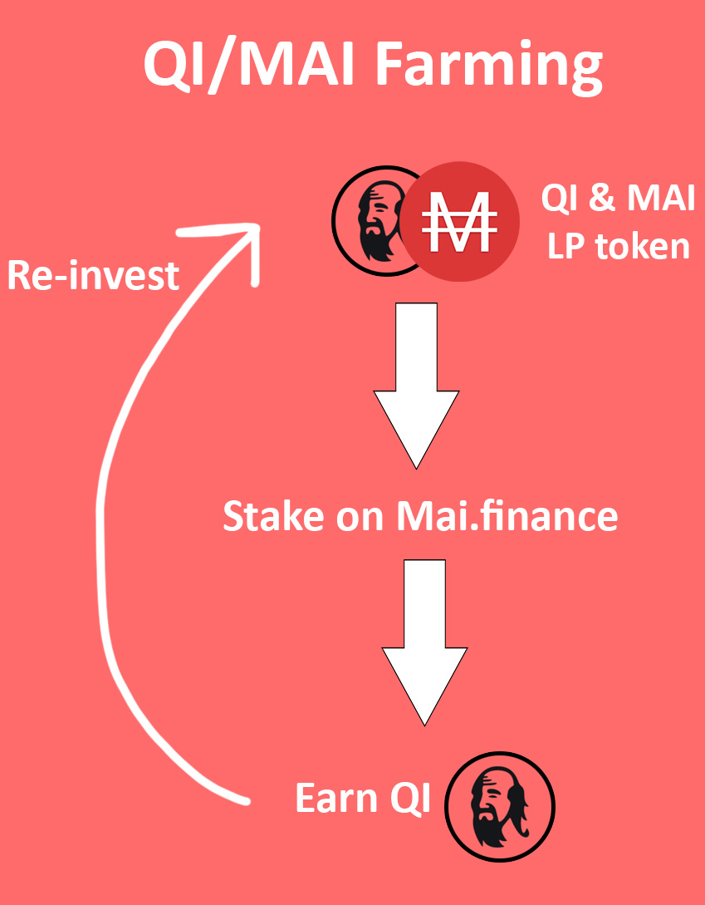
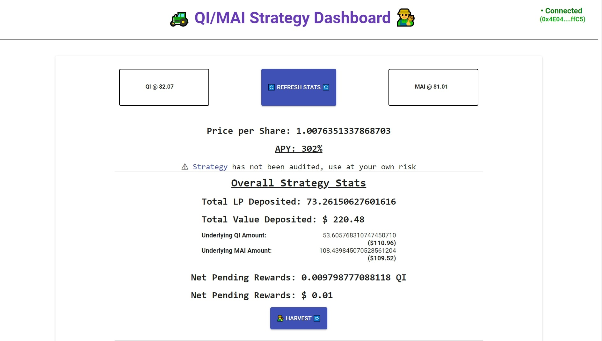
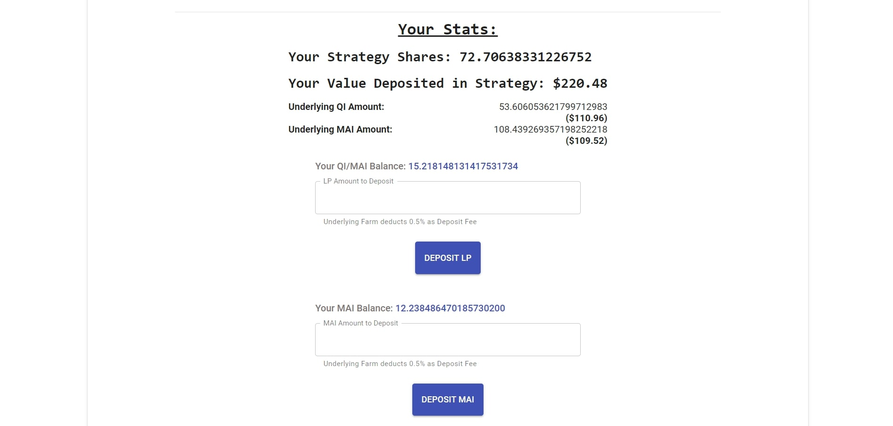
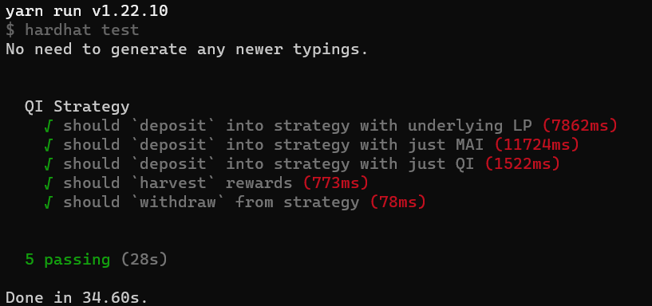

# QI Farming Strategy

Mai.finance is rewarding their governance token QI on staking the Quickswap LP token for QI/MAI Pair.

(Mai is a stablecoin pegged to $1)

Video Walkthrough: [YouTube](https://youtu.be/vvVbDwHnH8A)

## Working of Strategy:

This strategy allows the user to deposit their QI/MAI LP tokens, or if they just have single token QI or MAI lying in their wallet, the contract automatically swaps and converts that into required LP token so users can deposit instantly without any hassle.

Here's the simple overview:

## Harvesting

Due to Polygon's low transaction fees, we can harvest the rewards every few minutes. Due to this **the current APY is more than 300%!**

*Note: Mai's staking contract charges 0.5% on deposit, so it's advised for the user to not exit the pool instantly as they'll leave with less than what they deposited. Because of high APY this fees can be recovered in few days.*

## Deployment

The contract is deployed on Polygon Mainnet, you can interact with it via the UI here👉 [https://apoorvlathey.com/projects/qi-farming/](https://apoorvlathey.com/projects/qi-farming/)

(Note: Use at your own risk, contract is not audited)

## UI
The dashboard gives you all the necessary data about the strategy and allows to deposit/withdraw as shown:

## Smart Contracts
The repository uses `hardhat` to run tests for Strategy using forked mainnet. You can run `yarn test` to get the following result:

Note: You would need to configure variables in `./contracts/.env`. Refer to `./contracts/.env.sample`